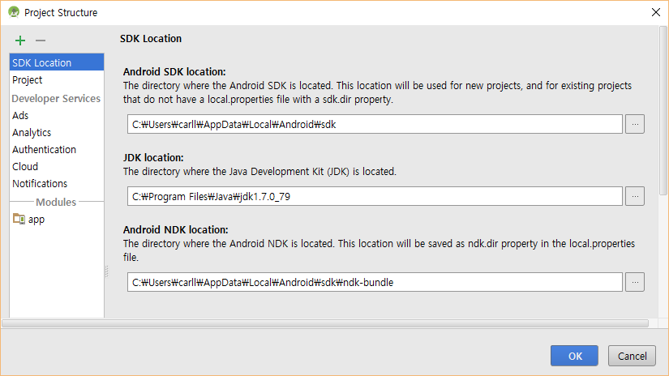

# Android Studio를 위한 빌드 자동화 Gradle

- 9장, 10장 소스 코드입니다.
- <a href="https://github.com/carllro/GradleForAndroidStudio/archive/master.zip" class="btn btn-sm">Download ZIP</a>을 눌러 다운로드 받으세요.
- 제9장 멀티모듈에서 JDK 8을 사용하면 에러가 납니다(곧 수정이 이루어질 것 같아서 책에는 적어 놓지 않았는데 지금도 에러가 나는군요). 에러가 나면 아래 화면에서처럼 File > Project Structure...에서 JDK 7로 바꾸고 실행(Run)하세요. 물론 JDK 7을 <a href="http://www.oracle.com/technetwork/java/javase/downloads/jdk7-downloads-1880260.html" target="_blank">오라클 홈페이지</a>에서 다운로드 받아 설치해야 합니다.  
